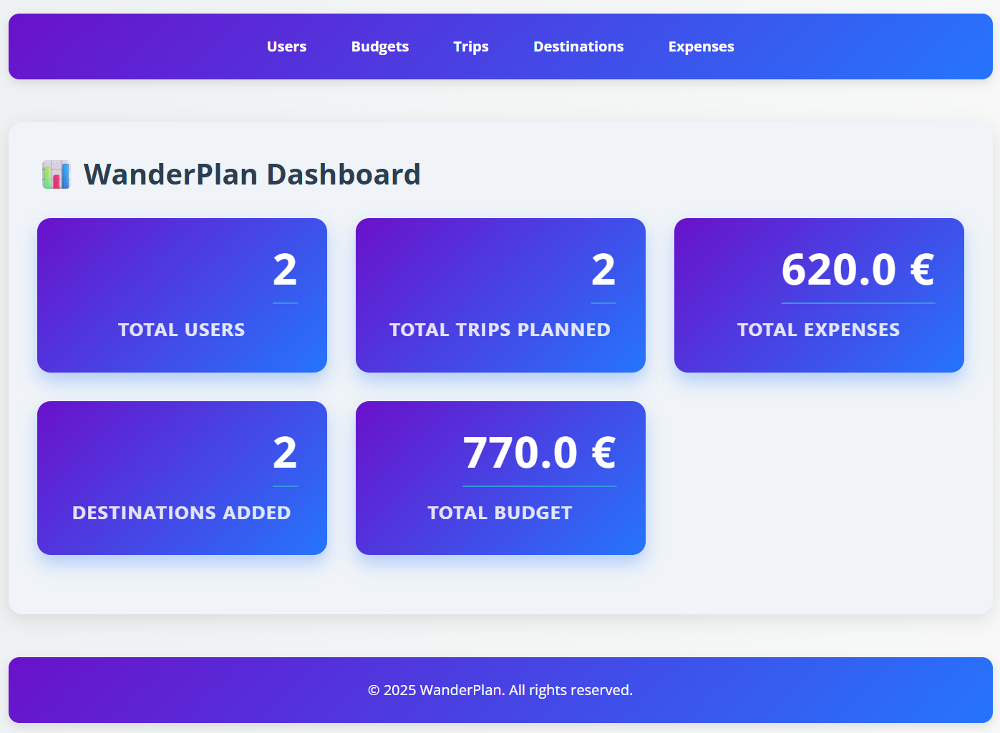
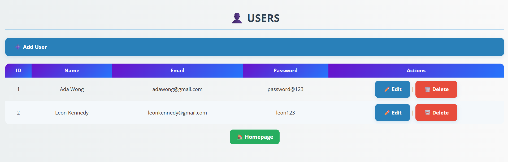
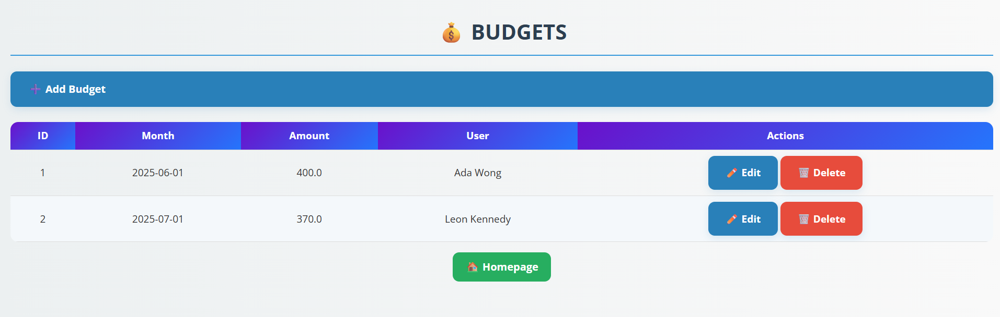
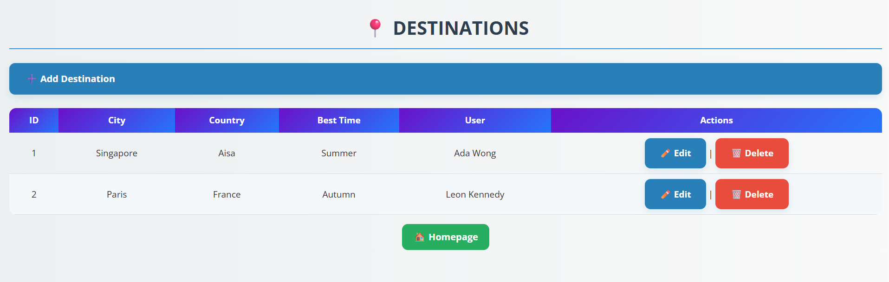
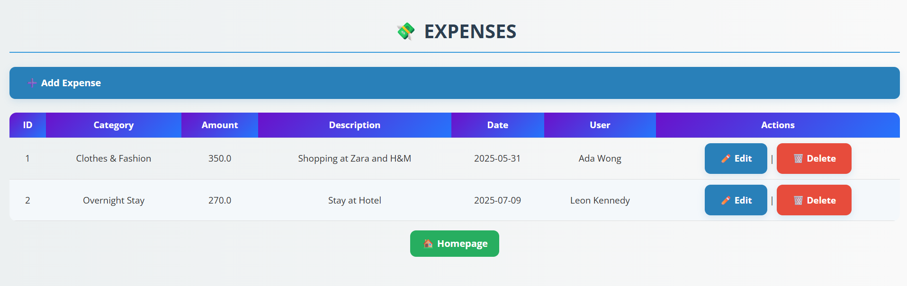

# WanderPlan – Travel Expense Tracker

**Personalized tracker to manage travel expenses efficiently.**  
WanderPlan is a Spring Boot-based web application that helps you plan trips, manage destinations, and track expenses with ease. Whether you're a solo traveler or a group planner, WanderPlan simplifies budgeting and expense tracking during your adventures.

---

## ✨ Features

- Add & manage users and travel destinations
- Track expenses by category and amount
- Intuitive web forms and responsive UI using Thymeleaf
- API tested using Postman
- Dockerized for seamless deployment
- Stylish, dashboard-like layout for better UX

---

## 🛠 Tech Stack

- **Backend:** Spring Boot, Spring MVC, Spring Data JPA
- **Frontend:** Thymeleaf, HTML/CSS
- **Database:** PostgreSQL
- **Testing:** Postman
- **Containerization:** Docker
- **Build Tool:** Maven

---

## ✅ Requirements

- Java 17+
- Maven
- Docker & Docker Compose (optional, for containerized setup)
- PostgreSQL server

---

## ⚙️ Setup Instructions

### Clone the repository
```bash
https://github.com/rohanvan19/WanderPlan---Expense_Tracker_WebApp.git
cd WanderPlan---Expense_Tracker_WebApp
```

### Configure Database

- Create a PostgreSQL database: wanderplan_db
- Update credentials in application.properties

```bash
spring.datasource.url=jdbc:mysql://localhost:3306/wanderplan_db
spring.datasource.username=your_db_username
spring.datasource.password=your_db_password
```

### Run the Spring Boot application

```bash
mvn spring-boot:run
```

- Open your browser and navigate to http://localhost:8080/

### Run with Docker

- Make sure Docker is installed and running
- Build and start the containers

```bash
docker-compose up --build
```

- Access the app at:
  http://localhost:8080/
- 
## 🖼️ Screenshots

### Homepage Dashboard


### Users Page


### Budgets Page


### Trips Page


### Destinations Page


### Expenses Page
